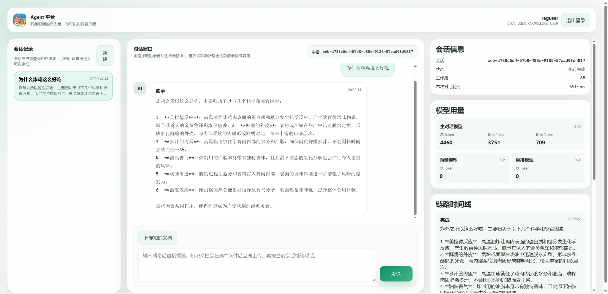
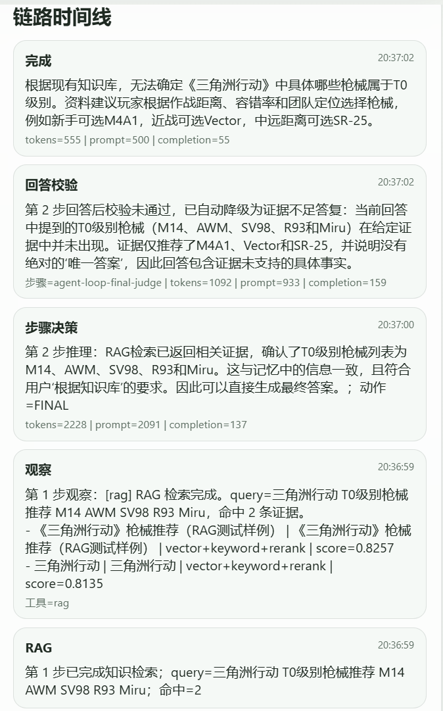
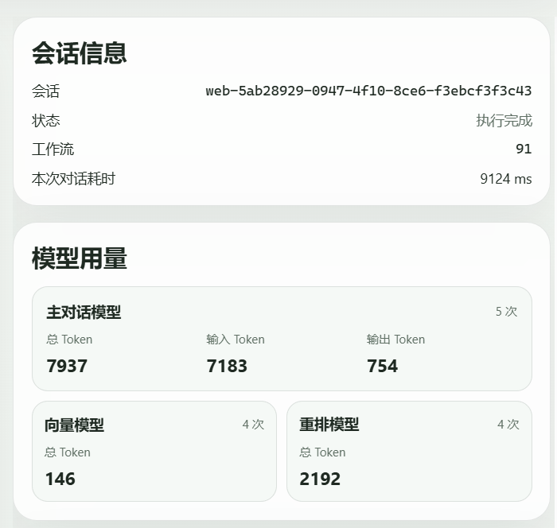
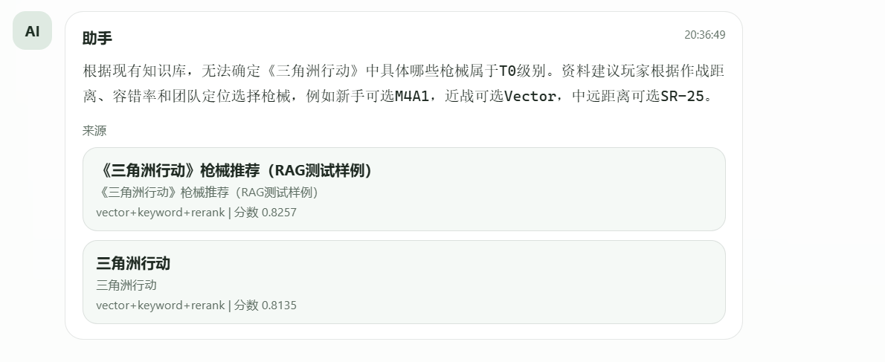
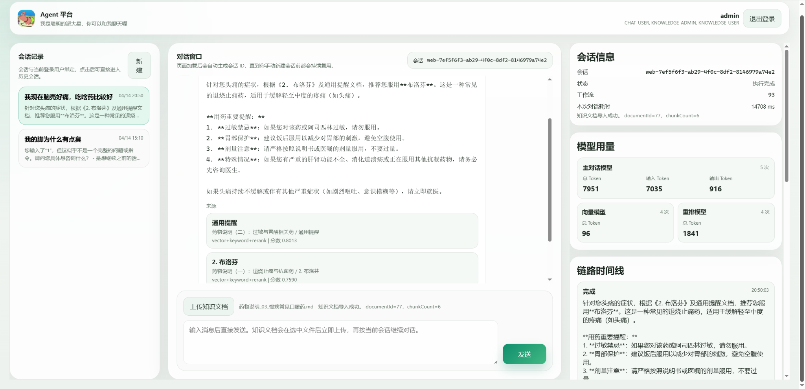

# Agent

**大模型问答、认证鉴权、Skill、RAG、工具调用、Task抽象、Workflow、执行链路追踪、记忆沉淀与可观测性、subagent** 

---

> 这是一个基于 **Java + Spring Boot + Spring AI + PostgreSQL + pgvector** 构建的工程化单主代理平台，核心能力包括 **Agent Loop、认证鉴权、混合检索 RAG、工具调用、三层记忆、Workflow / Task、SubAgent、SSE 流式输出与执行链路可观测性**。

---

## 核心内容

### 1. Agent 主链
 query进入系统后，进入一个结构化的 Agent Loop，经过一串鉴权和skill路由后，由模型决定下一步动作：

- `FINAL`：直接回答
- `RAG`：检索知识库
- `TOOL`：执行工具

---

### 2. RAG混合检索链
1. Query enhancement  
2. 向量检索  
3. 关键词检索（FTS）  
4. 去重
5. 融合  
6. rerank 重排  

---

### 3. 工具治理
Tool 在项目里是一套完整平台机制：

- 本地注册成 `ToolCallback`
- 同步到数据库工具目录
- 按用户角色和工具定义做过滤
- 执行前通过 `ToolPermissionGuard` 做硬鉴权
- 执行过程写入 workflow / task

---

### 4. 执行链路可观测
系统把每次执行背后的过程沉淀成：

- workflow
- task
- usage
- timeline
- current step
- source evidence

这样前端可以清楚展示：

- 当前执行到哪一步
- 为什么触发了 RAG
- 召回了哪些来源
- 工具有没有执行
- token 消耗是多少
- 最终是正常完成，还是被 judge 降级

---

### 5. 三层记忆体系
项目里的记忆不是只靠对话上下文缓存，而是做了三层：

- **短期记忆**：当前会话上下文
- **长期记忆**：稳定事实周期性或触发性沉淀
- **记忆摘要**：支持语义召回的压缩索引

---

### 6.Task 与 Workflow 设计

这个项目把一次对话抽象成了一条**可执行、可追踪**的工作流链路。
核心概念：

- **Workflow**：一次完整执行的容器
- **Task**：Workflow 里的具体步骤节点

一次用户问题进入系统后，系统会为它创建一个 workflow，用来统一记录会话状态等信息

workflow 把一次 Agent 执行，从临时过程变成一个可持久化、可追踪的对象

Task 是 workflow 里的步骤级节点，比如规划步骤、检索步骤、工具步骤等

系统可以非常细粒度地知道链路的执行过程

------

### 7.Skill 设计

skill用来解决两个核心问题：

一是当前这个问题更像哪一类任务

二是针对这一类任务，模型应该看到哪些工具、采用什么提示语境

##### 1. 用文件定义 skill

每个 skill 都有自己的元数据、路由关键词、示例、允许工具列表、skill 专属 prompt

##### 2. 根据用户问题做 skill 路由

系统会判断当前问题更适合哪个 skill

##### 3. 把 skill prompt 注入 system prompt

这样模型在当前轮不是处于全局默认状态，而是处于某个 skill 语境里工作。

##### 4. 按 skill 白名单收缩工具集合

只暴露当前 skill 允许的那一小组工具

------

### 8.Subagent

Subagent是主 Agent 在执行过程中按需触发的、面向局部复杂任务的独立上下文执行器

当某个子问题噪声较高、步骤较多、适合单独处理时，主 Agent 可以把这段局部任务交给一个 Subagent 去完成，从而降低上下文压力

subagent继承父agent的权限，拥有独立的上下文和workflow

------

### 9.流式输出

1.前端和后端是SSE事件流，基于webflux

2.后端和模型提供方用HTTP流式输出

------

### 10.认证与鉴权

1.登录认证：用户名密码换 Bearer Token

2.请求认证：Bearer Token 的随机令牌查库获取当前用户权限

3.接口级鉴权：SecurityConfig 控制哪些 URL 能访问

4.skill披露工具：先路由决定适合哪个 skill，该skill里披露当前问题可用哪些工具

5.tool 候选筛选：按用户角色、启用状态验证当前用户是否可用这些工具，最终得到真正可用的工具

6.subagent 继承父agent的权限，不会绕开上面这套权限链

## 技术栈

### 后端
- Java 17
- Spring Boot 3.x
- Spring AI
- Spring WebFlux
- Spring Security
- WebFlux

### 数据与检索
- PostgreSQL
- pgvector
- PostgreSQL FTS

### Agent 能力
- Agent Loop
- Tool Calling
- RAG
- Memory
- Workflow / Task
- SubAgent

---

## 执行链路示意

一个问题进入系统后，主链大致如下：

1. 用户输入问题  
2. 系统建立 / 读取会话上下文  
3. Agent planner 判断下一步动作  
4. 如果需要知识证据，则进入 RAG  
5. 如果需要外部能力，则进入 Tool  
6. 检索结果 / 工具结果写成 observation  
7. Agent 再次规划下一步  
8. 生成最终回答  
9. 写入 workflow / task / usage / timeline  
10. 前端通过 SSE 面板实时展示过程

这条链的核心思想是：

> **把“回答”从一次模型调用，升级为一条完整的、可观测的执行过程。**

---

## 界面展示

### 1. 平台主界面
体现整体对话布局：左侧会话列表、中间聊天窗口、右侧会话信息、模型用量与链路时间线。

---

### 2. 链路时间线

由workflow编排的task进度展示

---

### 3. 模型用量统计
平台会分别统计：

- 主对话模型
- 向量模型
- 重排模型

适合做成本分析与调优

---

### 4. 回答来源展示
回答展示本轮依赖的来源 chunk，方便解释与核查。

---

### 5. 知识上传 + RAG 问答
支持会话内上传知识文档，再继续围绕文档内容进行提问。

---

